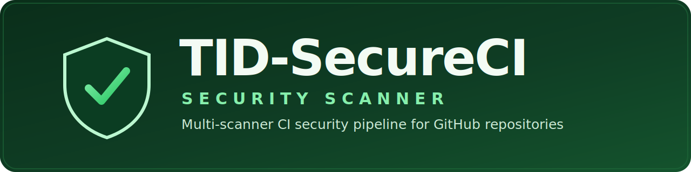

<div align="center">



<p><strong>One reusable workflow. Point it at any GitHub repo. Get a full security
report — by email, in the Security tab, and as downloadable artifacts.</strong></p>

<p>
  
  
  
  
</p>

</div>

---

## What is TID-SecureCI?

TID-SecureCI is a **reusable GitHub Actions security pipeline**. It lives in **one**
repository and scans **other** repositories — your own apps or a third party's — by
running six independent scanners in parallel and consolidating everything into a
single, branded report. It is tuned for **broad coverage** instead of one scanner
pretending to catch everything.

## Who it's for

- **App teams** that want continuous scanning on every push and PR without wiring up
  six separate tools in every repo.
- **Security & platform owners** who want one place to maintain scanning policy and
  keep a copy of every report.
- **Anyone vetting a third-party app** before adopting it — scan any public repo on
  demand and read the report first.

## What it scans

| Scanner | Looks for |
| --- | --- |
| **Semgrep** | Insecure code patterns (SAST) + custom AI/ML guardrails |
| **Gitleaks** | Secrets committed to git history |
| **OSV-Scanner** | Known-vulnerable dependencies in manifests / lockfiles |
| **Trivy** | Filesystem, dependency, secret, license, IaC, and optional image vulns |
| **Checkov** | Infrastructure-as-Code misconfiguration |
| **Syft (SBOM)** | A full software inventory (SPDX + CycloneDX) |
| **Dependency review** | Risky dependency changes on pull requests |

## What you get

- 📧 an **emailed report** — branded HTML + Markdown with a **Detailed Findings**
  table (every issue, with a link to review it in context) and the raw scanner
  output attached;
- 🔬 **code-scanning alerts** in the repo's **Security** tab (for repos you own);
- 📦 **workflow artifacts** with the raw SARIF and SBOM files;
- 📊 an at-a-glance **findings table** on the run's summary page.

## Quickstart — scan your app in three steps

1. **Add a caller workflow** to your app repo at `.github/workflows/scan.yml`
   (copy [examples/github/scan.yml](examples/github/scan.yml) and set
   `report_recipient` to your email):

   ```yaml
   permissions:
     contents: read
     security-events: write
     pull-requests: write
     actions: read
   jobs:
     secureci:
       uses: TIDHQ-NETWORK/TID-SecureCI/.github/workflows/tid-secureci.yml@master
       secrets: inherit
       with:
         enforce: false
         report_recipient: you@example.com
   ```
2. **Configure email once** (org or repo secrets) so reports can be sent —
   see [docs/EMAIL-SETUP.md](docs/EMAIL-SETUP.md).
3. **Push, open a PR, or run it manually.** When the scan finishes you get an
   emailed report, code-scanning alerts in **Security**, and downloadable
   artifacts.

> **Vetting someone else's repo?** Use
> [examples/github/scan-external.yml](examples/github/scan-external.yml) — an
> on-demand workflow that scans any public `owner/repo` you type in and emails you
> the report.

New to this? The full walkthrough is in
[docs/SCANNING-GUIDE.md](docs/SCANNING-GUIDE.md) — scanning your other repos,
vetting third-party apps, reading the report, and understanding severity.

## Best Private GitHub Setup

Store this repository as private, then in the repository that hosts TID-SecureCI go to:

`Settings -> Actions -> General -> Access`

Allow other private repositories in your account or organization to use this workflow.

For each app repository you want to scan, also enable these GitHub-native features in the app repo:

- CodeQL default setup
- Dependabot alerts
- Dependabot security updates
- Secret scanning and push protection

Those settings live at the repository level, so they complement this reusable workflow instead of replacing it.

## Use It From A Private App Repo

Add a caller workflow like [examples/github/scan.yml](/home/tangoisdown/LOTL/TIDHQ.NETWORK/TIDHQ.wormhole/TID-SecureCI/examples/github/scan.yml) to the app repository:

```yaml
name: Secure Scan

on:
  pull_request:
  push:
    branches: [main]
  schedule:
    - cron: "21 4 * * *"

permissions:
  contents: read
  security-events: write
  pull-requests: write   # dependency-review job (PR events) needs this
  actions: read          # sbom job needs this

jobs:
  secureci:
    uses: YOUR-ORG/TID-SecureCI/.github/workflows/tid-secureci.yml@master
    secrets: inherit
    with:
      enforce: false
      fail_severity: HIGH,CRITICAL
      image_ref: ghcr.io/YOUR-ORG/YOUR-APP:${{ github.sha }}
```

### Notes

- Start with `enforce: false` so you can tune noise before making the workflow blocking.
- Pin the reusable workflow to a branch or tag that actually exists in the SecureCI repo. The current default branch here is `master`.
- If you scan a different private repository than the caller, pass `target_repository`, `target_ref`, and a `checkout_token`.
- If your app does not build a container, leave `image_ref` empty.

## Workflow Inputs

| Input | Default | Purpose |
| --- | --- | --- |
| `target_repository` | caller repo | Repo to scan |
| `target_ref` | caller SHA | Branch, tag, or SHA to scan |
| `image_ref` | empty | Optional image to scan with Trivy |
| `fail_severity` | `HIGH,CRITICAL` | Blocking threshold for Trivy |
| `enforce` | `false` | Whether findings should fail the workflow |
| `enable_semgrep` | `true` | Enable Semgrep SAST |
| `enable_gitleaks` | `true` | Enable secret scanning |
| `enable_osv` | `true` | Enable dependency vulnerability scanning |
| `enable_checkov` | `true` | Enable IaC scanning |
| `enable_trivy` | `true` | Enable filesystem and image scanning |
| `enable_sbom` | `true` | Generate SPDX and CycloneDX SBOMs |
| `upload_artifacts` | `true` | Upload raw reports as workflow artifacts |
| `report_recipient` | owner address | Email address for this scan's report |
| `report_name` | `Application Security Scan Report` | Cover-page title |

## Results

You will get:

- SARIF alerts in the GitHub Security tab (`Security -> Code scanning alerts`)
- workflow artifacts for raw scanner output (`Actions -> the run -> Artifacts`)
- the rendered HTML/Markdown summary report in the `tid-secureci-report` artifact
- a findings table written to the run summary page
- SPDX and CycloneDX SBOM artifacts
- dependency review feedback on pull requests
- an optional emailed report (see below)

## Email Reports

On every run the `summary` job builds a branded report — a **TIDHQ.NETWORK cover
page**, a **preface**, and **numbered sections** — then emails the HTML body with
`report.html`, `report.md`, and the raw SARIF/SBOM files attached. The email is
sent only when SMTP is configured; otherwise the step is skipped and everything
else runs unchanged.

### Where reports go

- Each scan emails its report to the caller's `report_recipient` input.
- If a caller does not set `report_recipient`, the report goes to the TIDHQ owner
  address (`report_owner` secret).
- The TIDHQ owner address is **BCC'd on every report from other callers**, so you
  keep a copy of all scans for your records.

### Secrets

Set these on the SecureCI repo (or pass them through `secrets: inherit`):

| Secret | Required | Purpose |
| --- | --- | --- |
| `smtp_server` | yes | SMTP host — enables email when set. Proton: `smtp.protonmail.ch` |
| `report_owner` | yes | TIDHQ owner address — default recipient + BCC. Enables email when set |
| `smtp_username` | yes | SMTP user. Proton: your full Proton address |
| `smtp_password` | yes | SMTP password. Proton: the SMTP submission **token** |
| `smtp_port` | no | SMTP port, defaults to `587` (STARTTLS) |
| `mail_from` | no | From address, defaults to `smtp_username`. Proton: must match the token's address |

Email is sent only when both `smtp_server` and `report_owner` are present.

### Inputs

| Input | Default | Purpose |
| --- | --- | --- |
| `report_recipient` | owner address | Address this scan's report is sent to |
| `report_name` | `Application Security Scan Report` | Title on the cover page |

Full step-by-step instructions live in [docs/EMAIL-SETUP.md](docs/EMAIL-SETUP.md).

### Proton setup

Proton Bridge does **not** work in CI. You must use Proton's **SMTP submission**,
available on paid Proton Mail / Business plans:

1. In Proton, go to `Settings -> Mail -> IMAP/SMTP` and create an **SMTP
   submission token**.
2. Set the secrets: `smtp_server=smtp.protonmail.ch`, `smtp_port=587`,
   `smtp_username=<your Proton address>`, `smtp_password=<the token>`,
   `mail_from=<your Proton address>`, `report_owner=<your Proton address>`.
3. All mail is sent **from** your Proton address regardless of recipient, which is
   correct: TIDHQ delivers each report to the user who ran the scan.

## Local Helpers

The repo also includes local helper scripts:

- [scripts/clone_target_repo.sh](/home/tangoisdown/LOTL/TIDHQ.NETWORK/TIDHQ.wormhole/TID-SecureCI/scripts/clone_target_repo.sh)
- [scripts/generate_sbom.sh](/home/tangoisdown/LOTL/TIDHQ.NETWORK/TIDHQ.wormhole/TID-SecureCI/scripts/generate_sbom.sh)
- [scripts/install_gitleaks.sh](/home/tangoisdown/LOTL/TIDHQ.NETWORK/TIDHQ.wormhole/TID-SecureCI/scripts/install_gitleaks.sh)
- [scripts/install_osv_scanner.sh](/home/tangoisdown/LOTL/TIDHQ.NETWORK/TIDHQ.wormhole/TID-SecureCI/scripts/install_osv_scanner.sh)

Example:

```bash
bash scripts/clone_target_repo.sh https://github.com/your-org/your-app.git main ./target
bash scripts/install_gitleaks.sh
bash scripts/install_osv_scanner.sh
bash scripts/generate_sbom.sh ./target ./sbom
```

## Recommended Rollout

1. Put TID-SecureCI in a private repo.
2. Grant workflow access to your private app repos.
3. Add the caller workflow to one app repo.
4. Run with `enforce: false` for a few cycles.
5. Fix false positives and real issues.
6. Turn on `enforce: true`.
7. Add branch protection and require both `Secure Scan / secureci` and `Validate` before merge.

## Glossary

- **Reusable workflow** — a GitHub Actions workflow other repos call with `uses:`. TID-SecureCI is one.
- **Caller workflow** — the small `scan.yml` in your app repo that invokes the reusable workflow.
- **SAST** — Static Application Security Testing: scanning source code for flaws without running it (Semgrep).
- **SARIF** — the standard JSON format scanners emit so findings show up in the GitHub Security tab.
- **SBOM** — Software Bill of Materials: a full inventory of components in a build (SPDX + CycloneDX here).
- **CVE** — a public identifier for a specific known vulnerability (e.g. `CVE-2024-12345`).
- **Severity** — graded impact/exploitability of a finding: CRITICAL, HIGH, MEDIUM, LOW.
- **Secret** — a committed credential (API key, token, password, private key) that should never be in git.
- **IaC** — Infrastructure as Code (Terraform, Kubernetes, Dockerfiles); scanned by Checkov and Trivy.
- **Enforce mode** — whether findings fail the workflow (`enforce: true`) or are report-only (`enforce: false`).
- **Severity gate (`fail_severity`)** — which severities count as blocking when enforce is on.
- **SMTP submission token** — the Proton-issued password used to send report email from CI.

A fuller glossary and a complete how-to live in [docs/SCANNING-GUIDE.md](docs/SCANNING-GUIDE.md).
